<h1 align="center"><strong>Anto-Restaurant-Booking-System</strong></h1>

<h3 align="center">Full-Stack Project (HTML5, CSS3, Bootstrap, Django, Python, JavaScript, jQuery, PostgreSQL, Cloudinary)</h3>

 

**Developer:** Anthony Raj 

**[View live website here]()**  :computer:

# Table of Content
 * [Overview](#overview)
  * [UX](#ux)
    + [Strategy](#strategy)
    + [Scope](#scope)
    + [Structure](#structure-hr-)
    + [Skeleton](#skeleton-hr-)
    + [Surface](#surface-hr-)
      - [Color Scheme](#color-scheme)
      - [Fonts](#fonts)
  * [Agile Methodology](#agile-methodology)
  * [Features](#features)
    + [Existing Features](#existing-features)
      - [Create bookings](#create-bookings)
      - [ContactUs](#contactus)
      - [Menu](#menu)
      - [Profiles](#profiles)
      - [Admin bookings management](#admin)
    + [Future Feature Considerations](#future-feature-considerations)
  * [Responsive Layout and Design](#responsive-layout-and-design)
  * [Tools Used](#tools-used)
    + [Python packages](#python-packages)
  * [Testing](#testing)
  * [Deployment](#deployment)
    + [Deploy on heroku](#deploy-on-heroku)
    + [FORK THE REPOSITORY](#fork-the-repository)
    + [CLONE THE REPOSITORY](#clone-the-repository)
  * [Credits](#credits)
    + [Content](#content)
    + [Media](#media)
    + [Code](#code)
  * [Acknowledgements](#acknowledgements)

# Overview :

Anto-Restaurant-Booking-System Website was created as Portfolio Project #4 (Full-Stack Toolkit) for Diploma in Full Stack Software Development at [Code Institute](https://www.codeinstitute.net).

Project purpose was to build a full-stack site using agile methodology to plan and design web application using MVC framework and related contemporary technologies. Appplication offers users full CRUD (create, read, update, delete) functionality.

This is a project designed and developed to create a complete experience for the clients of Anto-Restaurant. The clients/guests are given opportunity to create an account, manage their account, create a booking and Edit, Delete.

This project is very much a personal one. This website look exactly as how I imagine my dream restaurant located in my hometown would look like.

## UX
This site was created respecting the Five Planes Of Website Design: 
### Strategy

**User Stories:**  

|   EPIC                                |ID|                                User Story                                                   |
| :-------------------------------------|--|:------------------------------------------------------------------------------------------- |
|**CONTENT AND NAVIGATION**             |  ||
|                                       |1A| As a user, I want to see a menu so I can easily navigate through website content |             
|                                       |1B| As a user, I want to see relevant information about the restaurant|
|                                       |1C| As a user, I want the website to have a nice and intuitive design that will match the restaurant's theme|
|**USER REGISTRATION/AUTENTHICATION**   |  || 
|                                       |2A| As a user, I want to be able to register on the website|
|                                       |2B| As a user, I want to be able to authenticate using only email and password|
|                                       |2C| As a user, I want to be able to log out at any time|
|**BOOKING**                            |  ||
|                                       |3A| As a logged-in user, I want to be able to find the available tables for a specific date and time|
|                                       |3B| As a logged-in user, I want to be able to select the table that I want to reserve|
|**MENU**                               |  ||
|                                       |4A| As a user, I want to see the restaurant's menu with details about description, category and price, so that I can make an informed decision|                                  
|**USER PROFILE**                       |  ||
|                                       |5A| As a logged-in user, I want to view a list of my upcoming bookings|
|                                       |5B| As a logged-in user, I want to be able to edit my bookings|
|                                       |5C| As a logged-in user, I want to be able to delete my bookings|
|**ADMIN MANAGE BOOKINGS**              |  ||
|                                       |6A| As a logged-in admin member, I want to see the restaurant's upcoming bookings for the current day sorted by time|
|                                       |6B| As a logged-in admin member, I want to be able to filter bookings by date|
|**CONTACT**                            |  ||
|                                       |7A| As a user, I want to see the restaurant's opening and closing hours|
|                                       |7B| As a user, I want to see location information on the website|
|                                       |7C| As a user, I want to see contact information on the website|

**Project Goal:** 
To create a website for Anto-Restaurant that will be beneficial for both clients and staff members which aims to maximise clients/customers experience and staff productivity, ultimately maximising the restaurant's revenue and customer satisfaction

**Project Objectives:**  
* To create a website with a simple and intuitive User Experience design;
* To add relevant content that aims to create a better image/branding of the restaurant;
* To differentiate between client and staff member accounts;
* To implement fully functional features that will ease the staff members' tasks and upgrade clients' experience with the restaurant services;
* To make the website fully responsive, and available and functional on every device.  

### Scope

**Simple and intuitive User Experience** 
* Ensure the navigation menu is visible and functional at every step;
* Ensure every page has a suggestive name that fits its content;
* Ensure the users will get visual cues and feedback when navigating through pages;
* Create a design that  is clear, precise, engaging and matches the restaurant theme.

**Relevant content** 
* Add information about restaurant name, location and contact data;
* Make a clear beautifully designed presentation of the menu elements;
* Create a booking section that is easy to navigate;

**Different client and staff member Accounts** 
* Allow clients to add, update or delete bookings their own bookings;
* Allow admin and staff members to add, update or delete bookings;
* Allow admin and staff members to add, update or delete menu items;
* Allow signed in clients access to Profile page;
* Allow access to Manage Bookings page only for staff members type of users;

**Responsiveness** 
* Create a responsive design for desktop, tablet and mobile devices.  

### Structure

The structure of the website is divided into seven pages but with content depending on authentication and client/admin status  
-**Register/Login** pages give the user the possibility to create an account and authenticate for accessing different features.  
-**Logout** feature is a modal that helps user exit their current account;  
-The **Home** page is visible for both types of users and includes details about the restaurant, and appropriate links to different pages;  
-The **Menu** page displays menu details and a food description and Category and price  
-The **Booking** page is only available for logged-in users, both clients and staff members;  
-**Contact us** contains relevant information visible to all users;

* FLOWCHARTS  
The Flowchart for my program was created using <b>pencil</b> and it visually represents how the system works. 

[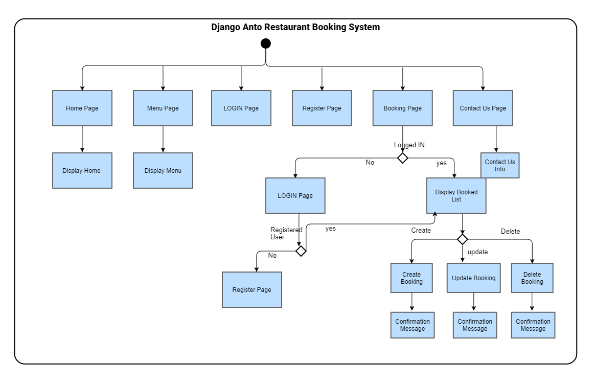](media/flowchart.png) 

### Skeleton

**Wireframes** 

The wireframes below were created the start of the project building.

The wireframes for mobile and desktop were created with [Balsamiq](https://balsamiq.com/) tool.

**Home Page**

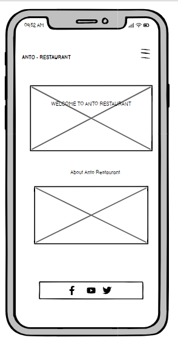
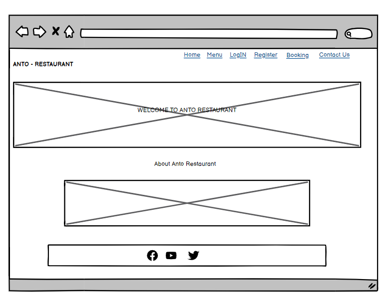

**Menu Page**

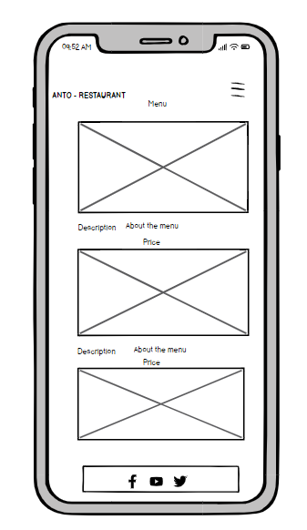
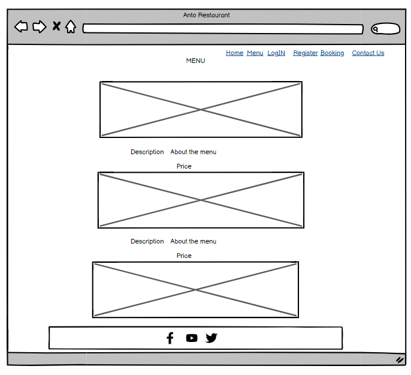

**Bookings Page**

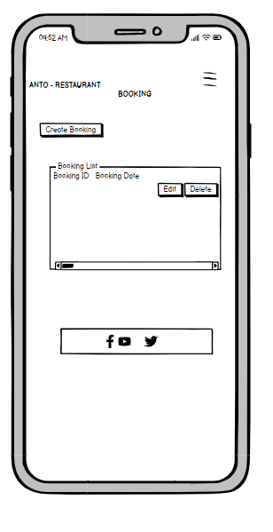
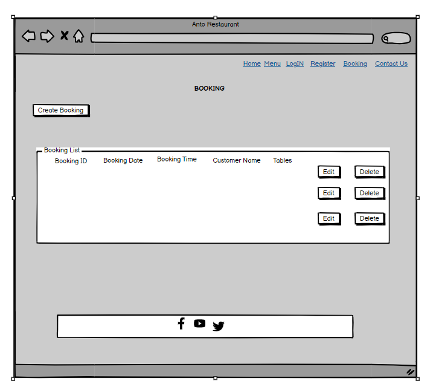

**Database** 

The project uses a cloud-based PostgreSQL database provided by [ElephantSQL](https://www.elephantsql.com/) as a service. ElephantSQL is known for its ease of use, and reliability, and is a popular choice for Django projects that require a PostgreSQL database. It offers a web interface with a console for SQL queries. Database URL including API key is stored as an environment variable in Heroku.
 

Initial Schema

The diagram below was created before the actual development of the website which led to some changes to the attributes and tables for finding the most relevant and useful ones to be kept. Due to time constraint, I was not able to make an updated version on time, but I will make sure to update this on future releases.

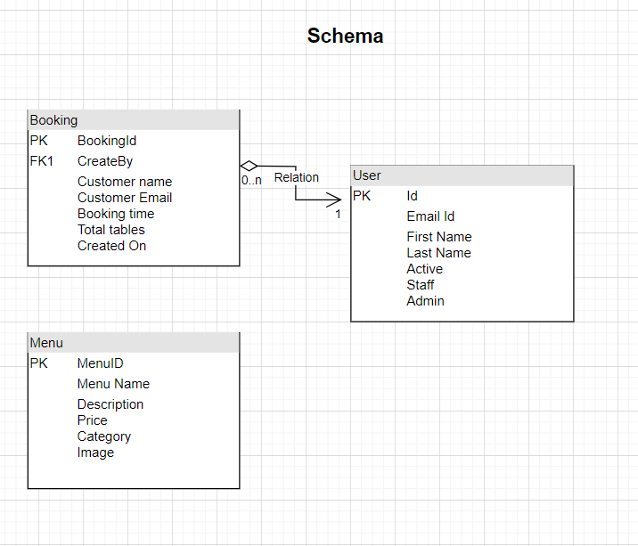

### Surface

#### Color Scheme
All the colors were selected using the hero image to generate color scheme using coolors (https://coolors.co/generate)

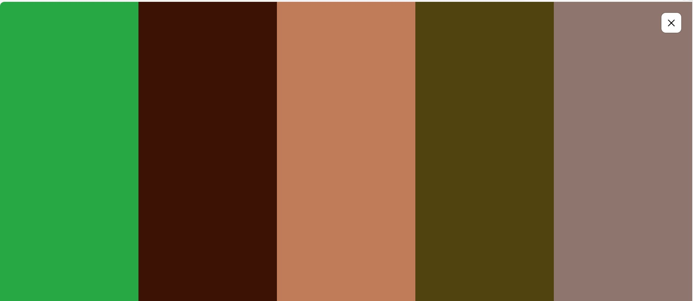

For consistency and convenience, I created css root variables that I used throughout the project.

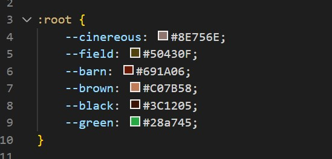

#### Fonts
* The fonts I used for this site were imported from [Google Fonts](https://fonts.google.com/): 
The [Roboto](('https://fonts.googleapis.com/css?family=Roboto:100,200,300,400,500,600,700|Exo:100,200,300,400,500,600,700');) font is the main font used throughout the whole website with Sans Serif as the fallback. Roboto is a clean, modern looking and well known font. It is sourced from Google fonts and it's linked to css document via @import method.

## Agile Methodology

This project was developed utilising the Agile Methodology.
This is the first time I used Agile methodology when planning full-stack Django website with a focus on delivering the basic app functionalities. I prioritized features by labelling them as "must-have" or "could-have" These stories helped to define the features and functionalities that were most important to project's target audience.

As a student solo developer who was learning a lot during development, I faced challenges in estimating the time required for each task and only had a basic concept of what I would create. Therefore, I kept things simple and focused on achievable goals. Aiming for Minimum Viable Product, or MVP.

To keep track of progress, I used Github Projects(https://github.com/users/Anthonyrajlucas/projects/4/views/1). I used a kanban board (https://github.com/users/Anthonyrajlucas/projects/4/views/1?layout=board) 

By using agile methodology, I was able to stay organized and focused on delivering the most important features, while also allowing flexibility for future development. This experience gave me valuable insight and lessons that I can apply to future projects.

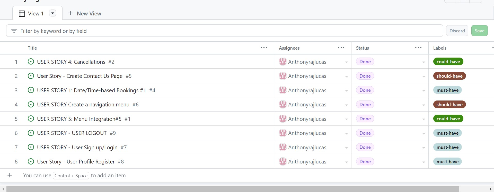
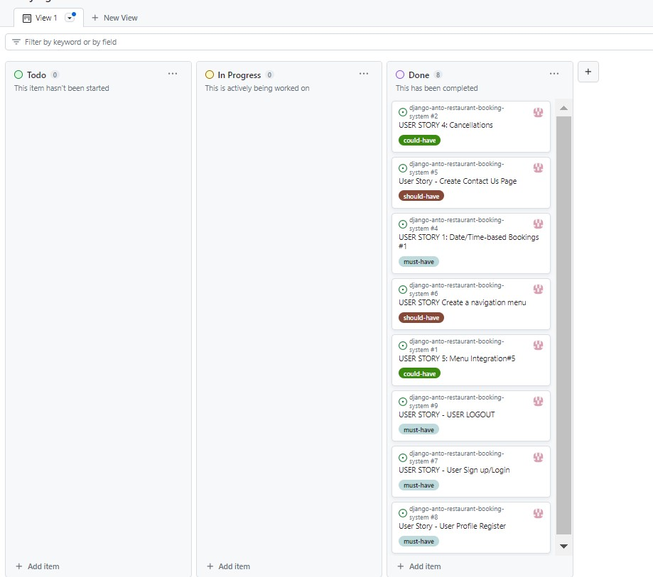

## Features
### Existing Features

### Navbar and main menu

Bootstrap navbar component was used to create the navigation bar. It is always visible and stays fixed at the top of the screen. The navbar consists of the Restaurant logo and links to the main areas of the site (home, menu, contact pages, Login, and Register). 

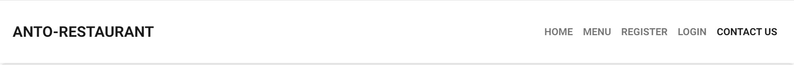  

After Login user can view booking and logout navbar 

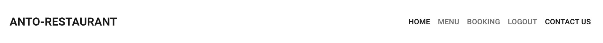  

### Home page

